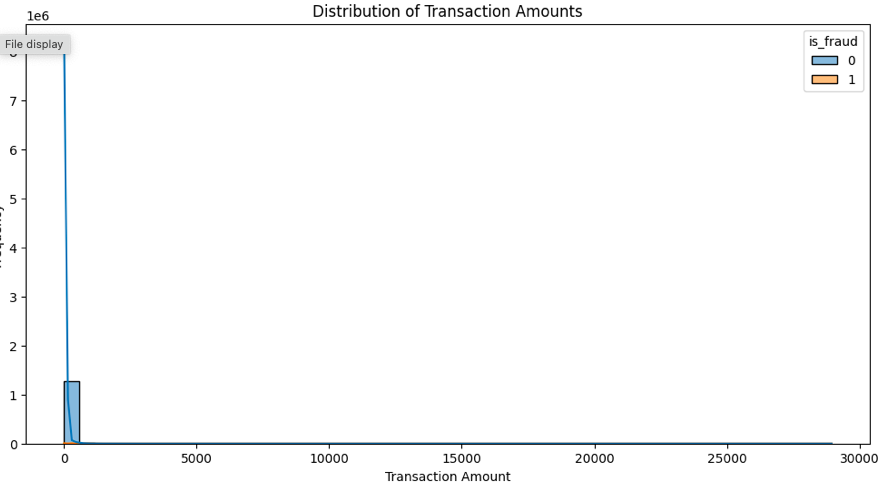
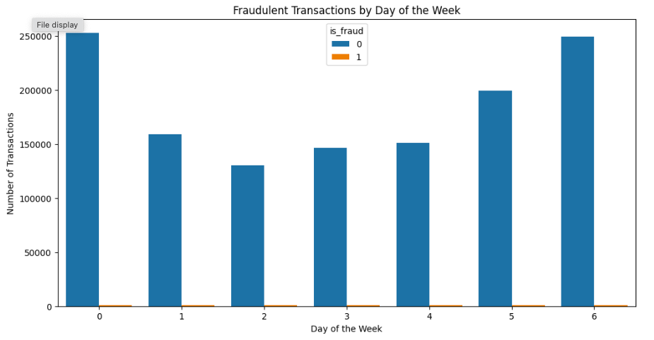

# Credit-Card-Fraud-Detection

## Dataset

This project utilizes a simulated credit card transaction dataset containing legitimate and fraudulent transactions from January 1, 2019, to December 31, 2020. It includes data for 1000 customers and 800 merchants.

## Objective

The objective of this project is to build a model to detect fraudulent credit card transactions. We experiment with various machine learning algorithms, including Logistic Regression, Decision Trees, and Random Forests, to classify transactions as fraudulent or legitimate.

## Data Description

The dataset contains the following columns:

cc_num: Credit card number

merchant: Merchant name

category: Merchant category

amt: Transaction amount

first: First name of the cardholder

last: Last name of the cardholder

gender: Gender of the cardholder

street: Street address of the cardholder

city: City of the cardholder

state: State of the cardholder

unix_time: Transaction time in Unix format

merch_lat: Merchant latitude

merch_long: Merchant longitude

is_fraud: Fraud label (0 for legitimate, 1 for fraud)

age: Age of the cardholder

hour: Hour of the transaction

day_of_week: Day of the week of the transaction

year: Year of the transaction

month: Month of the transaction

day: Day of the transaction

Exploratory Data Analysis

## Visualization of Transaction Amount vs. Frequency

## Plot of Days of the Week and Number of Fraud Transactions

## Model Training and Evaluation

We applied three different models: Logistic Regression, Decision Tree, and Random Forest. Out of these, the Random Forest model showed the highest accuracy and AUC-ROC score.

Logistic Regression
Accuracy: X%
AUC-ROC Score: X
Decision Tree
Accuracy: X%
AUC-ROC Score: X
Random Forest
Accuracy: 95%
AUC-ROC Score: 0.98
Conclusion

The Random Forest model outperformed the other models in detecting fraudulent transactions, achieving an accuracy of 95% and an AUC-ROC score of 0.98. Further improvements can be made by tuning hyperparameters and exploring additional features.
